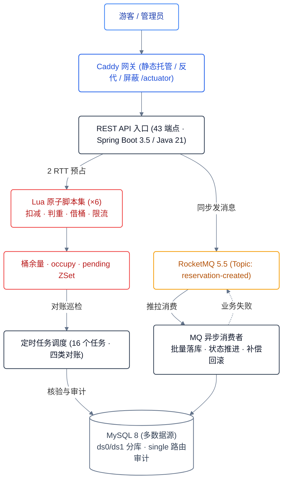
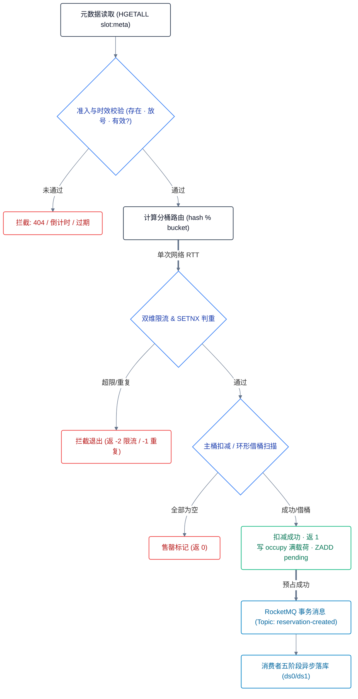

<div align="center">

# ReserveX

**湿地公园参观预约系统**

库存扣减在 Redis 侧原子完成,主表由消息异步落库,一致性由补偿与四类对账收口。<br>
三数据源分库分表,单进程模块化单体。

*A reservation system for a capacity-constrained wetland park — Redis-side atomic
stock decrement, asynchronous persistence via MQ, consistency closed by
compensation and four reconciliation jobs.*

[](https://github.com/s1oopX/ReserveX/actions/workflows/ci.yml)
[](LICENSE)
[](https://openjdk.org/projects/jdk/21/)
[](https://spring.io/projects/spring-boot)
[](#七工程验证)

</div>

## 技术栈

| 层 | 组件 |
|---|---|
| 应用 | Spring Boot 3.5 · Java 21 · MyBatis-Plus · Sa-Token |
| 存储 | MySQL 8(三数据源)· ShardingSphere 5.5 · Redis 7 + Lua |
| 消息 | RocketMQ 5.5(3 业务 topic + 3 DLQ) |
| 前端 | React 18 · Vite · TypeScript · Tailwind |
| 边缘 | Caddy(静态托管 + 反代 + `/actuator` 屏蔽) |
| 可观测 | Prometheus · Alertmanager · Loki · Alloy · Grafana |

## 目录

- [一、落地场景](#一落地场景)
- [二、关键决策一览](#二关键决策一览)
- [三、技术选型与理由](#三技术选型与理由)
- [四、具体实现](#四具体实现)
- [五、修过的真实缺陷](#五修过的真实缺陷)
- [六、能力边界](#六能力边界)
- [七、工程验证](#七工程验证)
- [八、快速开始](#八快速开始)
- [九、目录结构](#九目录结构)
- [十、设计文档](#十设计文档)

---

## 一、落地场景

湿地公园的**生态承载量是硬约束** —— 单时段可入园人数由环境容量决定,超了不是体验下降而是
生态损害。这把一个看似普通的预约需求变成了库存正确性问题:

| 业务约束 | 对系统的要求 |
|---|---|
| 每时段名额固定,不可超发 | 库存扣减不能超卖,且差异必须可对账、可追溯 |
| 放号瞬间集中抢号 | 扣减路径要扛并发,失败要快,不能靠排队掩盖 |
| 一证一天一次(实名限购) | 判重要全局唯一,且跨分库成立 |
| 凭证入园核销 | 身份证需密文存储 + 动态凭证 + 核销状态机 |
| 号过作废,名额不返还 | 「取消/过期」与「创建失败回滚」是两条**语义相反**的路径 |
| 三类角色 | 游客预约取消、工作人员核销、管理员运维处置 |

同一结构在售票、门诊挂号、疫苗预约、考试报名里反复出现:**有限库存 + 瞬时并发 + 实名限购 +
凭证核销**。本项目按这个结构做,而不是按「一个 CRUD 加缓存」做。

面向的读者有两类:要评估系统设计的人看第二至六节;要跑起来的人直接跳第八节。

### 系统架构



抢号请求只经过 Caddy → API → Redis 两次 round-trip 即返回;落库由消费者异步完成,
一致性由补偿与对账收口(见 [三、技术选型](#三技术选型与理由))。

---

## 二、关键决策一览

每一行都带**否决了什么**和**代价**。只写选了什么,看不出判断力。

| 决策 | 选择 | 否决的方案 | 代价 |
|---|---|---|---|
| 库存扣减 | Redis + Lua 原子脚本 | DB 行锁 / 悲观锁 | 库存真值在 Redis,需要对账兜底 |
| 扣减与落库一致性 | 普通消息 + 补偿 + 对账 | RocketMQ 事务消息 | 存在「已扣未落」中间态,需三条收口通道 |
| `occupy` 生命周期 | **不设 TTL** | 30min TTL + 定时续期 | 只能由业务路径回收,泄漏必留证据 |
| 回滚 | 拆两类,各自独立路径 | 一个通用「释放」脚本 | 两套代码,但不会同时少约与超卖 |
| 分库键 | `user_id % 2`,user 与 reservation 绑定表 | 按 `slot_id` 分 | 按 slot 查要广播,仅用于低频管理操作 |
| 判重 | Redis `SET NX` + DB 唯一键双防线 | 只靠其中一道 | pepper 进了主键,不可轮换 |
| 库存差异处置 | 默认只告警,人工确认 | 自动修复 | 需要人介入,但不会把在途预约改错 |
| 限流 | 折叠进抢号 Lua | 独立限流器组件 | 抢号路径固定 2 次 round-trip |

---

## 三、技术选型与理由

### 3.1 为什么库存放 Redis 而不是 DB 行锁

放号瞬间是同一行的写热点。DB 行锁把并发压成串行,连接池先耗尽,表现是「全站变慢」而不是
「抢号失败」。Redis 单线程执行 Lua,天然串行且无锁开销,扣减、判重、借桶、限流在一个脚本内
原子完成。

代价明确:**库存真值不在 DB**。所以必须有对账 —— 这是第 4.3 节存在的原因,不是附加功能。

前提也明确:Redis 必须 `maxmemory-policy=noeviction`。配成 `allkeys-lru` 会**静默删掉库存
key**,而现象是「莫名超卖」,排查方向会全错。这条写进了启动验收(第七节)。

### 3.2 为什么弃用 RocketMQ 事务消息

最初方案用事务消息保证「Redis 扣减」与「DB 落库」一致。真正落地时发现它要求本地事务与半消息
确认在**同一个请求线程**内完成 —— 等于把 DB 写回拉进抢号请求线程,「抢号只动 Redis」这个前提
当场失效,DB 重新成为瓶颈。

改为:Redis 扣减成功后**同步发送普通消息**,消费者异步落库。代价是出现「Redis 已扣、DB 未落」
的中间态,用三条**互相独立**的通道收口:

1. `occupy:{rno}` 满载荷 —— 落库所需字段全在里面,消息丢了也能重建
2. `pending:persist` ZSet + 扫描器 —— 超时未落库则补投,**只补投,不自主回滚**
3. 四类对账 —— 定期校验不变量,差异入账

任何一条停摆,另两条仍在。这是「不把正确性押在单点上」的具体落地。

### 3.3 为什么 `occupy` 刻意不设 TTL

`occupy` 是**扣减后的恢复证据**。早期设计给它 30min TTL 并由扫描器续期,问题是:
「库存已扣但未落库」这个事实**会自己消失**。一旦它在补投耗尽或调度停摆期间过期,回滚所需的
桶 key 与配额位就再也拿不到 —— 库存永久泄漏,而对账只能报出差异、修不掉。

「续期」把正确性押在「扫描器每轮都活着」上,而调度停摆恰恰是最该被兜住的故障。

现在删除权只属于两处:**成功落库的消费者**、**补偿脚本**。别处删 = 库存泄漏。转人工时把回滚
参数抄进 `stuck_reservation` 表,可回滚性不依赖 Redis 存活。

### 3.4 为什么回滚必须分两类

这是最容易写错的地方,写错的表现是**同时少约与超卖**:

| | A 类:创建失败补偿 | B 类:取消 / 过期 |
|---|---|---|
| 语义 | 预约从未成立 | 预约成立后作废 |
| Redis | 桶 +1、删判重位、清售罄标记 | **不碰** |
| DB | 作废孤儿行 | 状态机 CAS |
| 触发 | 仅业务确认失败(配额冲突) | 用户操作 / 到期扫描 |

合成一个「释放」脚本,B 类会错误回补桶余量 → 超卖;A 类若不回补 → 少约。

A 类**禁止由「落库超时」自主触发**:超时不等于失败,落库可能已成功,自主回滚会造出「DB 有
预约但 Redis 余量已回补」的幽灵预约,而对账会把它算成差异却修不掉。

### 3.5 三数据源与分库

`user` / `reservation` / `reservation_transition_outbox` 按 `ds$->{user_id % 2}` 分两库,
user 与 reservation 设为**绑定表**保证同一用户的数据同库、join 不跨库。

路由表(邮箱/手机/身份证 → user_id)与审计表放**独立单库数据源**,配独立事务管理器。分片
mapper 与单库 mapper **物理分包**,防止误挂默认数据源 —— 这类错误编译期不报、运行期只在特定
分片键上暴露。

### 3.6 身份证三字段

`ciphertext`(AES-256-GCM,支持密钥轮换)+ `hash`(全局 pepper,用于唯一性判重)+
`masked`(脱敏展示)。

hash 刻意用**全局固定 pepper 而非 per-row 盐** —— 用逐行盐会让同一张证在不同用户下得到不同
hash,全局唯一直接失效。代价是 pepper 进了配额表主键,**不可轮换**。这是本项目唯一「照书做
反而错」的地方,决策与代价都记在 `docs/03`。

---

## 四、具体实现

### 4.1 抢号链路




状态校验前置在应用层而不是 Lua 内:业务分支清晰(三种返回各带倒计时),且不污染原子扣减脚本。

**空值缓存**:查 DB 无此场次时写短 TTL 标记。`GET /api/slots/{slotId}` 不需要登录,边缘按设计
不做限流 —— 没有这道缓存,拿随机 id 刷它就是每请求一次主键 SELECT。标记用**独立 key**,不能写
在 `slot:meta` 那个 Hash 上(类型冲突会让后续 HGETALL 报 WRONGTYPE,把 404 变成 500)。

### 4.2 库存模型

容量按 `bucket_count` 拆桶,`hash(rno) % bucket_count` 定主桶,规避单 key 热点。余数按
「前 `capacity % n` 个桶各多 1」分摊 —— 若给所有桶传 `capacity / n`,Σ桶 < capacity,库存
不变量会永久带一个固定差,而对账每轮报同样的差异且查不出原因。

增容只增不减(已抢走的名额收不回),三件同步:DB `capacity` CAS + 逐桶 `total` + Redis 逐桶
`INCRBY`。任何「桶余量从 0 变正」的路径都必须清售罄标记 —— 补偿、放号、增容三处,漏一处即
「幽灵售罄」:运营加了名额但用户依然约不到。

### 4.3 不变量与四类对账

| 任务 | 方向 | 频率 |
|---|---|---|
| `reconcile-a` | Redis → DB | 1min |
| `reconcile-b` | DB → Redis(反向,正负号相反) | 5min |
| `stock` | 逐桶比对 | 5min |
| `route` | 配额位 ↔ 预约,双向 | 10min |
| `pending-idx` | pending 索引 ↔ occupy,清脏索引 | 5min |

正反两个方向都记,是为了能发现「两个方向同号」这类异常 —— 那意味着两套对账代码读了不一样的
数据。逐桶比对而非只比总数,否则「总数相等、桶位错配」会被绕过。

库存差异**默认只告警不自动修**。自动修会把正常在途的预约误判成差异并改掉;开启需在配置里显式
打开并带状态守卫。

### 4.4 核销

动态凭证 `v1.{kid}.{rno}.{exp}.{nonce}.{HMAC}`,60 秒有效,支持密钥轮换(旧 kid 保留至窗口
结束)。验签用**常量时间比较**,过期与 kid 白名单独立校验。

手工核销需核对证件号后四位,并在**单员工**(5 次/10min)与**单预约**(20 次/10min)两个维度
限流 —— 只限一个维度都能被绕过。所有失败尝试入 `verification_log`,与成功流水分列存放。

### 4.5 可观测性

10 个自定义埋点全部指向**补偿链路水位**,而不是「QPS 好看」:补偿触发、补投次数、卡单入表、
卡单逾期、死信捕获、待落库积压、当前对账差异、MQ 发送失败。

理由:补偿链路成功时一声不响、失败时也只留一行日志。没有这些指标,「补偿在正常工作」与
「补偿一直在失败」从外部看完全一样。

24 条告警规则 / 8 个抓取目标。日志走 ECS JSON → alloy → Loki,`requestId` 平铺到 JSON 根级,
可按它把 HTTP 与消息两侧串起来。

---

## 五、修过的真实缺陷

这些是项目里实际发生、已修复的问题。共同点:**功能测试与健康检查全绿,而某条不变量已经失效**。

| 缺陷 | 后果 | 修法 |
|---|---|---|
| 补偿脚本混用两类回滚语义 | 同时可能少约与超卖 | 拆成两条独立路径 |
| 空值标记写在 Hash 同名 key 上 | 后续 HGETALL 报 WRONGTYPE,404 变 500,该场次永久进不了缓存 | 改用独立 key |
| 告警渲染守卫误匹配自己的注释 | Alertmanager 启动即退出、无限重启,**告警一封发不出**,而 compose 只显示 restarting | 先剥注释行再查 |
| 风控计数 `INCR` 后单独 `EXPIRE` | 两条命令间崩溃 → 计数器永不过期 → 用户被永久要求验证码 | 合进一条 Lua,用 `EXPIRE NX` |
| 埋点 key 裸 `INCR` 无 TTL | `noeviction` 下每场次每桶一条永久驻留 | `EXPIRE NX`,顺带收口已泄漏的老 key |
| 配置项声明与读取不同步 | 一个方向是「改了不生效」,另一个是「运维在单一真理源里找不到」 | 反射遍历双向断言 |

两条 TTL 修复都用 `EXPIRE ... NX` 而不是「仅首次 INCR 时设」:后者修不掉**已经泄漏**的 key,
因为它们的 `INCR` 永远不会再返 1。

---

## 六、能力边界

**刻意不写吞吐量数字。** 压测脚本在 `stress-test/`,但没有留档的测量结果 —— 项目自己的规矩是
「没实测过的数不写」。写一个编出来的 QPS,在「这个数怎么测的、几台机器、什么数据分布」这一问
上就会崩掉。

已实现并验证:

- 扣减、判重、借桶、限流在 Redis 侧原子完成,抢号路径固定 2 次 round-trip
- 库存不变量由四类对账校验,最密 1min 一轮,差异有账可查
- 「Redis 已扣、DB 未落」有三条独立收口通道,任一停摆不导致库存泄漏
- 取消/过期与创建失败走不同路径,互不污染
- 全链路可按 `requestId` 追溯(HTTP 与消息两侧)

明确的限制:

- **单实例**。多实例需每个实例显式配 `WORKER_ID`(生产环境启动即断言),定时任务选主未实现
- **单机 Redis**。前提是 `noeviction` + `appendfsync always`,两条都写进了启动验收
- **无压测留档**。容量规划与限流阈值是推算值,不是实测值
- **邮件是界外旁路**。SMTP 不可用只降级告警,不参与库存链路;健康检查刻意不含邮件探活

未实现但在文档里留了演进位与判据:定时任务选主、跨机房、热点 key 自动发现、自动弹性伸缩。

---

## 七、工程验证

| 项 | 规模 |
|---|---|
| 后端主代码 | 101 个文件 / 11,560 行 |
| 后端测试 | 44 个文件 / 6,950 行 / **221 个测试** |
| Lua 脚本 | 6 个 + 16 条契约断言 + 7 个真 Redis 冒烟用例(33 条断言) |
| 数据表 | 19 张(跨三数据源) |
| HTTP 端点 | 43 个(严格资源式 URI) |
| 定时任务 | 16 个 |
| 前端 | 26 个页面 / 76 个 ts/tsx,三角色路由 |
| 设计文档 | 12 份 / 4,062 行 |

三类测试各回答不同的问题:

- **单元/契约测试** —— Lua 脚本的形态约束还在不在(借桶上界、埋点 TTL、字段位次)
- **真 Redis 冒烟** —— 脚本在真引擎上的行为(限流零副作用、借桶命中正确的桶、幂等回补不二次
  执行、`EXPIRE NX` 对两种前置态的处理)
- **配置守卫** —— 反射遍历配置类,双向断言「yml 声明的都有读取点」且「代码读的都在 yml 里」

跨库一致性用 Docker 全栈验:15 个服务起齐、8 个抓取目标全 up、按 `requestId` 在 Loki 精确命中
单笔请求、空值缓存标记的 TTL 在重复请求下**递减而非重置**(证明请求确实没打到 DB)。

每条新增守卫都做过反向验证:把它要防的缺陷放回代码,确认测试变红并指出正确的位置。一条在缺陷
存在时依然通过的测试等于没有。

---

## 八、快速开始

```bash
cp .env.example .env
```

`.env.example` 里有 **14 个变量没有默认值,必须全部填上**。只填四把密钥不够 —— 漏任何一个,
`docker compose` 的**所有子命令**都会因插值失败而报错,而报错只提它撞上的那一个(例如只说
Grafana 口令),不会告诉你还漏着另外几个。

```bash
# ① 四把密钥:必须两两不等,启动时 SecretGuard 断言,相同即拒绝启动
openssl rand -base64 32   # AES_KEY,必须恰好 32 字节
openssl rand -base64 48   # ID_HASH_PEPPER
openssl rand -base64 48   # QR_HMAC_KEY
openssl rand -base64 48   # JWT_SECRET

# ② 基础设施口令
#    MYSQL_ROOT_PASSWORD / MYSQL_APP_PASSWORD / REDIS_PASSWORD
#    ROCKETMQ_APP_SECRET_KEY / ROCKETMQ_ADMIN_SECRET_KEY  ← 这两个必须互不相同
openssl rand -hex 32

# ③ 观测面板口令。⚠️ 缺它 compose 直接拒绝解析 ——
#    Grafana 在没设口令时不报错,而是静默回落到 admin/admin
openssl rand -base64 24   # GRAFANA_ADMIN_PASSWORD

# ④ 超管首登密码(团队可见,首次登录强制改密)
#    ADMIN_INIT_PASSWORD

# ⑤ 邮件三项。演示环境可填占位值,代价是发信 535 失败(容器仍能起来):
#    QQ_SMTP_PASSWORD=占位  SMTP_FROM=you@qq.com  ALERT_EMAIL_TO=you@qq.com
#    ⚠️ SMTP_FROM 必须与 QQ_SMTP_PASSWORD 是同一个账号,否则 SMTP 认证 535
```

填完自检 —— 直接查「还有哪个是空的」,不数总行数(可选的内存覆盖项填不填都行,总数因人而异):

```bash
grep -nE "^[A-Z_0-9]+=$" .env     # 有输出 = 那几行还没填;无输出才算填完
docker compose config --quiet && echo "插值通过"
docker compose up --build
```

访问 <http://localhost:8080>。超管 `admin@reservex.local`,初始密码取 `.env` 的
`ADMIN_INIT_PASSWORD`,**首次登录强制改密**。

> 超管邮箱是写死的(`02-seed.sql` 与 `application.yml` 各一处),不是环境变量 —— 它同时是
> `email_route` 的主键,改它要两处一起改,否则登录第 1 跳查不到。

> ⚠️ `.env` 在 `.gitignore` 里,**永远不要提交**。仓库里只有 `.env.example`(变量名,无值)。

### 启动验收四条

已有卷由一次性 `mysql-migrate` 按 checksum 幂等迁移。**不要**在日常验收执行
`docker compose down -v` —— 它会删除 MySQL / Redis / RocketMQ 业务数据。

| # | 验什么 | 怎么验 |
|---|---|---|
| ① | 起得来 | 首页不是 404;三个库表齐;超管能登录且那行落在 `ds1` |
| ② | 密钥断言真会拦 | 把 `.env` 里两个密钥填成同一个值,启动必须失败 |
| ③ | 三处时区一致 | MySQL / JVM / Jackson 都是 `Asia/Shanghai` |
| ④ | Redis 前提成立 | `maxmemory-policy` = `noeviction`;`appendfsync` = `always` |

③④ 不验,所有时间判据和「库存放 Redis」的前提就建在错的地基上 —— 配成 `allkeys-lru` 时
Redis 会**静默删掉库存**,而现象是「莫名超卖」。

### 本地开发

```bash
cd backend && mvn spring-boot:run          # 需 mysql/redis/rocketmq 已起
cd frontend && npm install && npm run dev  # vite 代理 /api 到 localhost:8080
```

密钥走 shell 或 IDE 配置,不在 `application.yml` 里写死任何值。

---

## 九、目录结构

| 路径 | 内容 |
|---|---|
| `backend/` | Spring Boot 3.5 / Java 21,单 jar 含 API + 消费者 + 定时任务 |
| `frontend/` | React 18 + Vite + Tailwind,产物由 `frontend-build` 拷进命名卷 |
| `docker-compose.yml` | 15 个服务:6 常驻 + 3 一次性 + 6 可观测 |
| `docker/mysql/` | 初始化 DDL / 种子 / `migrations/` 按 checksum 幂等迁移 |
| `docker/rocketmq/` | 显式建 3 个业务 topic + 3 个 DLQ topic |
| `docker/alertmanager/` | 告警路由模板 + 渲染入口(变量缺失即 fail-fast) |
| `caddy/Caddyfile` | 统一入口:静态资源 + `/api` 反代 + 屏蔽 `/actuator` |
| `docs/` | 12 份设计基准 |
| `stress-test/` | wrk2 抢号脚本(需先备 token 池) |

## 十、设计文档

`docs/` 是**编码基准**而非事后补写的说明 —— 决策、否决理由、故障覆盖矩阵都在里面。

| 文档 | 内容 |
|---|---|
| [00-决策基准](docs/00-决策基准.md) | 全部锁定决策与自审修正 |
| [01-业务规则与状态机](docs/01-业务规则与状态机.md) | 角色、状态迁移、库存不变量 |
| [02-抢号链路](docs/02-抢号链路.md) | 预占、补投、卡单、窗口期接口行为 |
| [03-数据库设计](docs/03-数据库设计.md) | DDL、分库边界、分阶段事务 |
| [04-Lua脚本](docs/04-Lua脚本.md) | 六个脚本的契约与调用方对照(抢号脚本与代码逐字一致) |
| [05-缓存与限流](docs/05-缓存与限流.md) | 穿透/雪崩、分层限流、降级分级 |
| [06-MQ与最终一致](docs/06-MQ与最终一致.md) | 幂等、重试分级、定时任务可靠性、故障矩阵 |
| [07-页面与闭环](docs/07-页面与闭环.md) | 三前端与六条业务闭环 |
| [08-部署与工程](docs/08-部署与工程.md) | compose、可观测、编码红线 |
| [09-压测与验收](docs/09-压测与验收.md) | 验收矩阵与故障注入 |

---

## 许可

[MIT](LICENSE)
